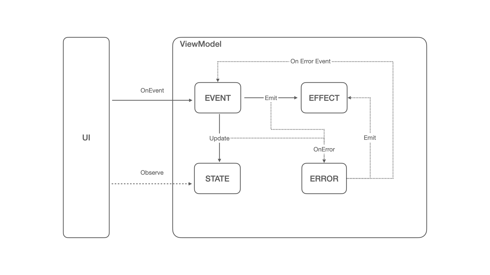

# UI-Architecture
안드로이드 UI 구조를 효과적으로 빌딩하기 위한 아키텍처 라이브러리. MVI 기반의 아키텍처로 State Event Effect를 제어하여 사용자와 UI간의 상태 및 이벤트 흐름과 사이에 발생하는 이펙트를 효과적으로 처리할 수 있습니다.

### 사용방법

sample 프로젝트 참고
1. `BaseViewModel`를 확장한 `ViewModel` 추가
2. `BaseState`를 확장한 `State` data class 추가
3. `BaseEvent`를 확장한 `Event` sealed interface 추가
4. `BaseEffect`를 확장한 `Effect` sealed interface 추가
5. (필요시) `BaseError`를 확장한 `Error` data class 추가
6. override 되는 `createConfig()` 메서드를 바탕으로 Config 초기 값 설정
7. `BaseViewModel`에 정의한 bind 메서드를 사용하여 event, effect, error 플로우 제어
8. state의 경우 자체 `StateFlow`를 관측하여 UI 상태 감지 가능

### Architecture

